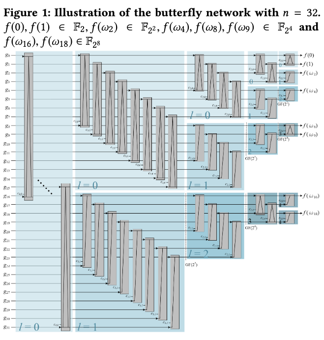
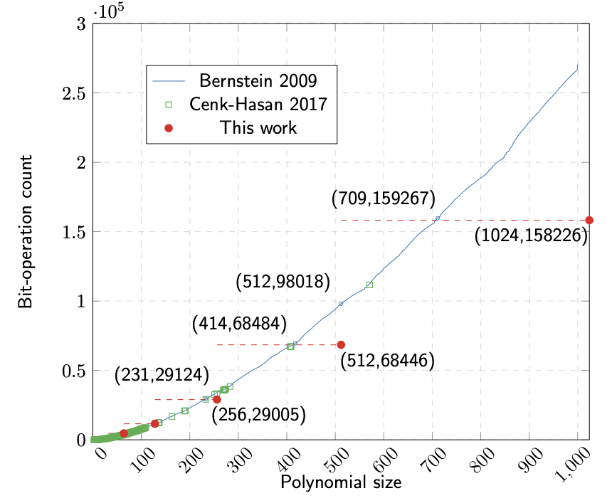

# Combinatorial Circuit Generator for Binary Polynomial Multiplication


> [**Frobenius Additive Fast Fourier Transform**](https://dl.acm.org/doi/10.1145/3208976.3208998)
>
> by Wen-Ding Li, Ming-Shing Chen, Po-Chun Kuo, Chen-Mou Cheng, Bo-Yin Yang
>
> ACM International Symposium on Symbolic and Algebraic Computation (ISSAC) 2018

[Conference Presentation Slides](slides.pdf)

## Introduction

Binary polynomial multiplication, i.e. polynomial multiplication over the boolean field, arises in many hardware applications, such as Reed-Solomon codes and cryptographic applications like AES.

The best-known algorithm for small binary polynomial multiplications is the Karatsuba algorithm, while larger binary polynomials typically use FFT-based algorithms. However, the exact optimal circuit complexity for binary polynomial multiplications of around 1024 bits remains unknown. Finding more efficient algorithms is both practically and theoretically important.

We propose a new algorithm for binary polynomial multiplication using the Frobenius Additive Fast Fourier Transform (AFFFT), which is a generalization of the classical FFT.

We provide a circuit generator that produces bit operations (AND & XOR) for binary polynomial multiplication using the AFFFT algorithm developed in our paper [Frobenius Additive Fast Fourier Transform](https://dl.acm.org/doi/10.1145/3208976.3208998).

The generated circuit has a butterfly structure that can be used for pipelined implementation.



## Usage

```bash
$ python affft_codegen.py [log_2(input_size)]
```

Example:
```bash
$ python affft_codegen.py 8
```
The above command will generate bit operations of binary polynomial multiplication with two input size 256 and output size 512


# Results



Please cite our paper if you use this code in your research.
```
@inproceedings{10.1145/3208976.3208998,
author = {Li, Wen-Ding and Chen, Ming-Shing and Kuo, Po-Chun and Cheng, Chen-Mou and Yang, Bo-Yin},
title = {Frobenius Additive Fast Fourier Transform},
year = {2018},
isbn = {9781450355506},
publisher = {Association for Computing Machinery},
address = {New York, NY, USA},
url = {https://doi.org/10.1145/3208976.3208998},
doi = {10.1145/3208976.3208998},
booktitle = {Proceedings of the 2018 ACM International Symposium on Symbolic and Algebraic Computation},
pages = {263–270},
numpages = {8},
keywords = {additive FFT, complexity bound, fast fourier transform, finite field, frobenius FFT, frobenius additive FFT, frobenius automorphism, polynomial multiplication},
location = {New York, NY, USA},
series = {ISSAC '18}
}
```